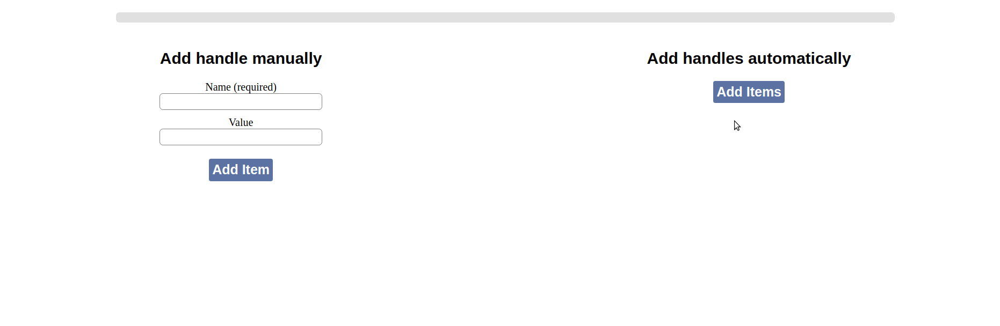

It's JavaScript percentage slider with the possible of adding and removing handles. (Works in IE11+)<br>
[Demo](https://zarwlar.github.io/percentage-slider/)

Preview
-------------


Install
-------------

NPM
```
npm install percentage-slider --save
```

Usage
-------------

```javascript
import PercentageSlider from 'percentage-slider';
import 'percentage-slider/package/percentage-slider.css';

const rootElem = document.getElementById('root');
const slider = new PercentageSlider(rootElem);

const itemData = {
  name: 'handle-1',
  value: 0,
  onChange: (value) => console.log(value),
  color: '#a3d70b'
};

slider.addItem(itemData);

/* Some work ... */

slider.removeItem('handle-1');
```

API
-------------
### PercentageSlider Constructor
- **rootElem** — DOM element inside which will be inserted slider
### PercentageSlider Instance
#### addItem
- **options**:
```
{
  name: String // Name of adding item
  value?: Number // Initial value for handle (from 0 to 100)
  onChange?: (value: Number) => void // Callback with a new value as an argument
  color?: String // Color of line. If isn't provided, then line will be had random color. Can take the same values as in the css property background-color
}
```

#### removeItem
- **name** — Name of removing item
